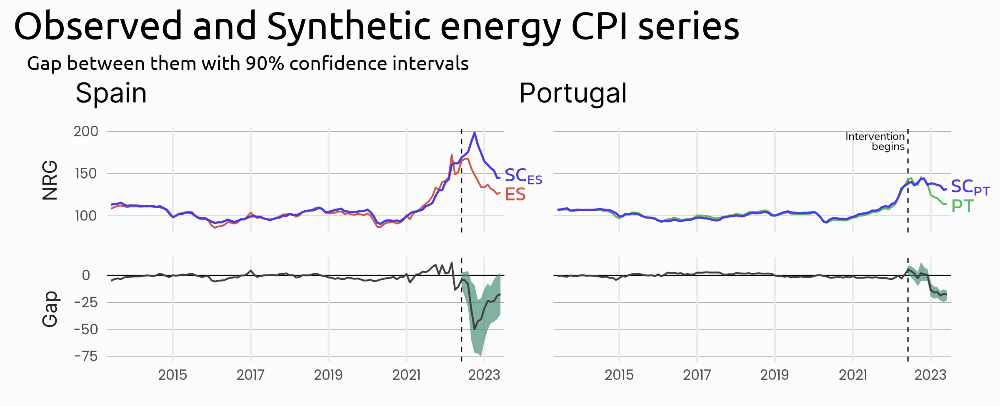

# ibex

A tool to explore the effect of the Iberian exception mechanism on inflation. It can be used to replicate the figures and tables in *Haro-Ruiz, M., Schult, C. & Wunder, C. (2023). The effects of the Iberian Exception mechanism on wholesale electricity prices and consumer inflation. A synthetic-controls approach*. Additionally, users can explore the effect of the intervention on a variety of inflation indicators.



## Deployment

ibex can be deployed in a Docker container. To do so, you must have [Docker](https://www.docker.com/) installed on your computer.

Begin by cloning this repository from the command line:

```shell
git clone https://github.com/mharoruiz/ibex && \
cd ibex
```

Make sure your working directory points to the cloned repository. You can check this with `pwd` or `cd`, depending on your command line. 

Next, run a Docker container from an image that includes all the necessary dependencies:

```shell
docker run --rm \
-p 8787:8787 \
-e DISABLE_AUTH=true \
-v "$(pwd):/home/rstudio/ibex" \
-v /home/rstudio/ibex/renv \
mharoruiz/ibex:0.1
```

The above command creates and runs a new container (`docker run`) from the image `mharoruiz/ibex:0.1`, and mounts project files (`-v`) from your local directory as source (`$(pwd)`) to the container directory as destination (`/home/rstudio/ibex`).

---

**Troubleshooting** 

Depending on the command line in your computer, you may have to use `%cd%` instead of `$(pwd)`. If none of these methods works, you can substitute the source with the absolute path to the cloned repository in your local machine (something like `C:\Users\user\ibex` or `/Users/user/ibex`). 

Another source for potential errors is the `\` at the end of every line in the `docker run` command above. These allow multiline code to be executed and make the code block above easier to read than a single, long line of code. Depending on your command line, you may have to use `^` instead of `\`. However, you can also remove the linebreaks and execute the command as a single line.

---

The first time you execute `docker run` successfully, the command line should inform you that the image is being pulled from a Docker repository with the following message:

```
Unable to find image 'mharoruiz/ibex:0.1' locally
0.1: Pulling from mharoruiz/ibex
```

This process may take some time. However, subsequent executions of `docker run` will use a locally saved image to run the container. When this happens, your command line should print messages indicating that the container is being initialized. You can now access the container by pointing your browser to `localhost:8787`. This will open a ready-to-use instance of RStudio. 

Open `ibex/ibex.Rproj` in the RStudio session to load the project dependencies. The following message should appear in your R console:

```R
- Project '~/ibex' loaded. [renv 1.0.2]
```

## Replication

The script `ibex/main.R` replicates the figures and tables in Haro-Ruiz, M., Schult, C. & Wunder, C. (2023). You can adjust the value of constant `PRC_STEP` in line 21 to regulate the script's runtime. Execute the script by pressing Cmd/Ctrl + Shift + S or using the following command:

```R
source("~/ibex/main.R")
```

Once `main.R` has successfully run, the figures and tables will be accessible as variables in your R environment, i.e. `fig_1`, `table_A1`. Additionally, if constant `SAVE_ANALYSIS=TRUE`, the figures and tables will be saved to `04_analysis/` as .png and .csv files.

## Exploration

The script `explore.R` outlines a framework to further explore the effect of the Iberian exception mechanism on inflation using the ibex tool. In particular, it estimates the effect of the intervention on goods-only CPI and services-only CPI, as well as the inflation rates of these indicators. 

Like `main.R`, `explore.R` begins defining a series of constants used throughout the script. `SUB_VARS` is a vector with CPI variables which make up `WHOLE_VAR`. In this case, the combination of GD (goods only) and SERV (services only) make up CP00 (all items). Furthermore, `PRE_TREATMENT_PERIODS` is a vector with the size of the pretreatment periods for the computation of synthetic controls for each of the variables in `INPUT_VARS`. Since `INPUT_VARS` has length 3, `PRE_TREATMENT_PERIODS` must also have length 3. 

Moreover, `CONFIDENCE_INTERVALS=TRUE` and `PRC_STEP=.025`. This will result in more precise confidence intervals than the ones computed in `main.R`, where `PRC_STEP=.1`. This will come at the cost of longer runtime of the script. Feel free to try different `PRC_STEP` values and determine which one is the most appropriate. 

The function `estimate_sc()` is called in line 40 to estimate the synthetic controls for each of the CPI indicators and pre-treatment period sizes defined above. This returns a dataframe called `sc_series_exp` which will be used later on for plotting. Next, `inference_sc()` is called in line 48 to conduct inference on the estimated synthetic controls. 

---

**Challenge #1**

Can you create a dataframe that summarizes the results for each input variable and treated country over the entire post-treatment period? 

**Hint 1:** For this challenge, you should use functions `get_ate_table()` and `get_pval_table()`. Before calling them in the script, you have to import them into your environment, either by including their string names in the `functions` vector defined in line 32, or via the following command:

```R
source("01_functions/get_ate_table.R")
source("01_functions/get_pval_table.R")
```

Too easy for you? Are you able to create a dataframe that summarizes the results for three sub-periods in the post-treatment? The three sub-periods should be: 1)July-December 2022, 2)January-June 2023, and 3)July 2022-June 2023.

**Hint 2:** The resulting dataframe should be analogous to `table_A1`, defined in `main.R`. Refer to this example as a solution for this challenge. 

Can you also modify `explore.R` to automatically save the resulting dataframe to `05_exploration/ate_table.csv` when `SAVE_OUTPUT=TRUE`?

**Hint 3:** `main.R` automatically saves the tables when `SAVE_OUTPUT=TRUE`. Refer to this script as a solution for the last part of this challenge.

---

`explore.R` also uses function `plot_results()` to plot the observed and synthetic series as well as the difference between them, for outcomes GD and SERV. If `SAVE_OUTPUT=TRUE`, the plots will be saved in `05_exploration/` as `fig_gd.png` and `fig_serv.png`. There are two other instances of `plot_results()` in `explore.R`, which instead of plotting from `sc_series_exp`, do so from `sc_inflation_rate_exp`. The latter daframe is a transformation of the former, which contains the 12-month rate of change of the CPI outcomes, also known as the year-on-year inflation rate. The resulting plots are saved in `05_exploration/` as `fig_gd_rate.png` and `fig_serv_rate.png`.

Next, the script calls function `plot_decomposition()` to visualize the effect of the Iberian exception mechanism on all-items inflation rate as a share of the effect on goods-only and services-only inflation rate. The resulting plots for Spain and Portugal are saved in `05_exploration/` as `fig_decomp_es.png` and `fig_decomp_pt.png`.

---

**Challenge #2**


The figure above shows different aggregations of CPI indices and the relationship between them. For example, NRG (energy CPI) and CP00xNRG (all-items CPI excluding energy) make up CP00 (all-items CPI). Similarly, we know from `explore.R` that GD and SERV make up CP00. 

For this challenge, pick any two CPI aggregations that you would like to explore. The two variables of your choice must combine into a third, broader CPI category. For example, NRG and IGDxNRG combine to form IGD. 

Next, create a new R script and name it `my_exploration.R`. The script should first estimate synthetic control units for each of these CPI aggregations and conduct inference on the estimates. Use functions `estimate_sc()` and `inference_sc()` to get this done.

Once you do this, transform dataframe outputed by `estimate_sc()` to include the year-on-year inflation rate. Use the transformed dataframe in combination with `plot_results()` to visualize the effect of the Iberian exception on your two outcomes of choice. 

Now, use functions `get_ate_table()` and `get_pval_table()` to create a dataframe that summarizes the effect of the intervention on the three outcomes you are analyzing for both Spain and Portugal over the entire post-treatment period. 

Finally, use `plot_decomposition()` to understand how the Iberian exception affected the two CPI aggregations of your choice with respect to the broader category. Look into the left and middle panels of the resulting plot: Which of the outcomes, if any, can explain the effect on the third one better? Refer to the right panel to analyze whether the added effect of the two indices is approximately equal to the broader index. Are the results for Spain and Portugal similar? How do they differ?

---